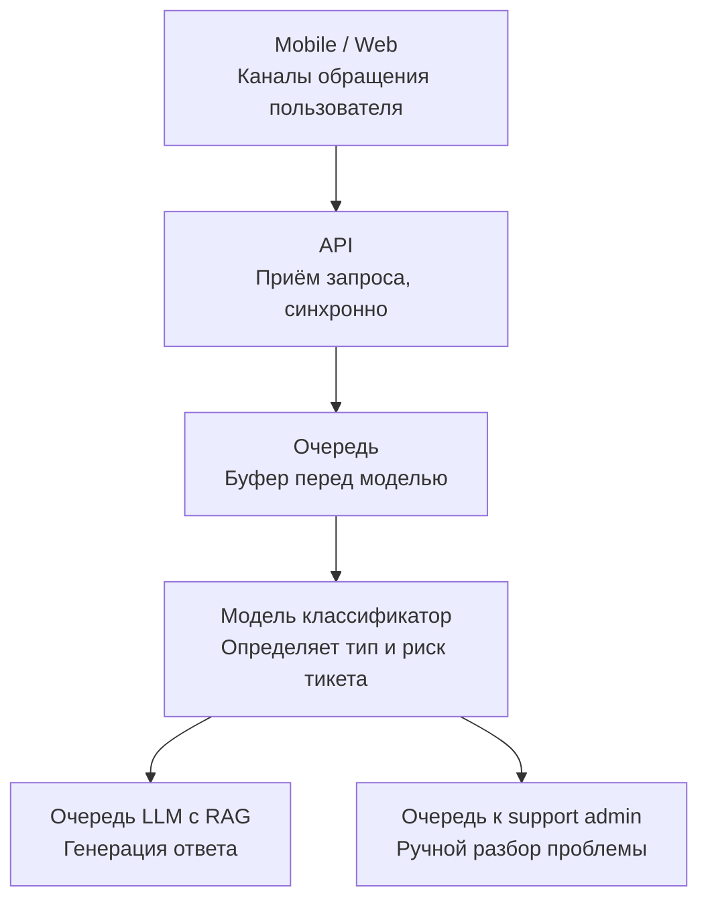

# Архитектура (черновик)

```mermaid
flowchart TD
    A[Mobile / Web<br/>Каналы обращения пользователя] --> B[API<br/>Приём запроса, синхронно]
    B --> C[Очередь<br/>Буфер перед моделью]
    C --> D[Модель классификатор<br/>Определяет тип и риск тикета]
    D --> E[Очередь LLM с RAG<br/>Генерация ответа]
    D --> F[Очередь к support admin<br/>Ручной разбор проблемы]
```
